

A selection of my work in autonomous systems — from the maritime autonomy stack I currently lead, through industrial robotics and interpretable AI, to the platforms where I started in real-time robotics.

## Autonomous & Remotely-Operated Maritime Systems
*2025 – present · Autonomous Intelligent Systems Lab (AISLab), Turku*

My role: I lead the simulation, digital-twin, and multi-sensor perception development for autonomous and remotely-operated vessels that monitor marine areas and protect critical seabed infrastructure in the Baltic Sea. This is part of the USVA project (*Uncrewed Surface Vessels for Automated Maritime Critical Infrastructure Protection*), coordinated by Turku UAS and funded by Business Finland (≈ €1.3M), with field testing on real platforms.

### Real platforms
The USVA pilot vessel is a 14-metre Watercat M12, formerly operated by the Finnish Navy and refurbished with Marine Alutech for remote operation — controlled from distant shore stations, carrying environmental-monitoring and underwater-inspection sensors, and engineered to keep operating under GPS/communication interference and to comply with the international maritime rules of the road (COLREG). The lab's electric research vessel *eM/S Salama* serves as a second on-water testbed for sensor integration and sim-to-real validation.

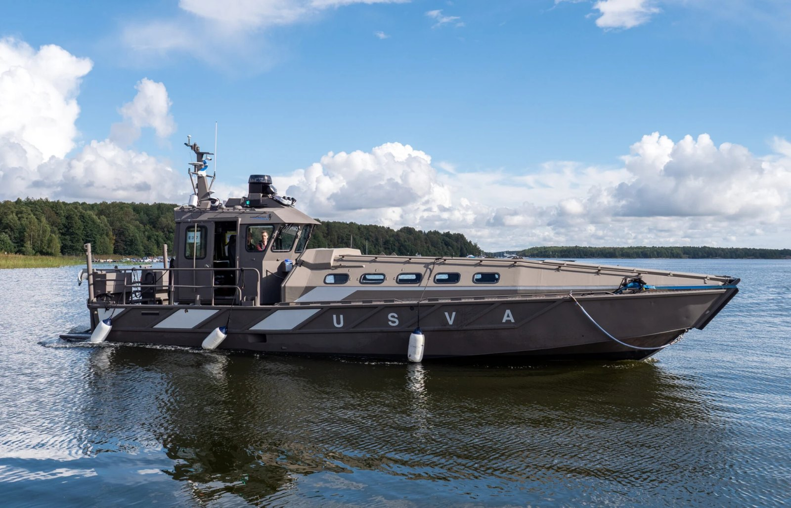

<em>The USVA pilot vessel — a 14 m Watercat M12 refurbished for remote operation. Photo: Turku UAS / USVA project.</em>

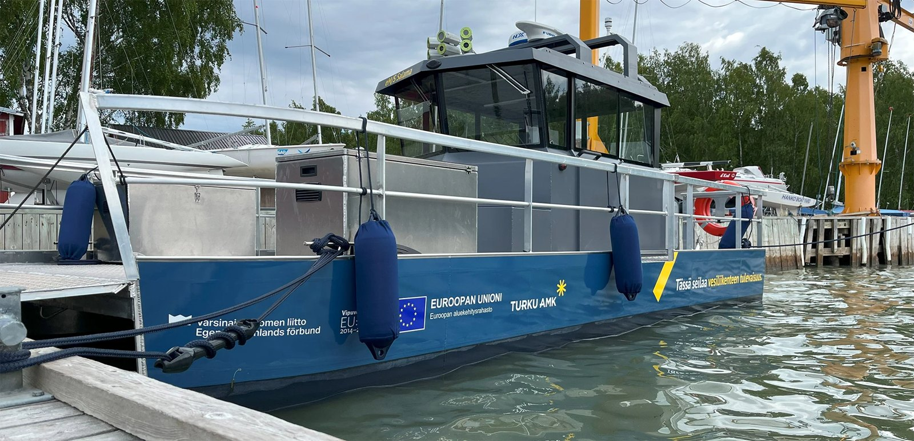

<em>eM/S Salama, the lab's electric research vessel. Photo: Turku UAS.</em>

### Digital twin & distributed sensing
A digital twin links live vessel telemetry with the simulation environment over a distributed sensor architecture (Fast DDS, MQTT, TCP/IP, UDP), enabling safe, repeatable AI testing, decision support, and real-world situational awareness before anything is trialled on the water.

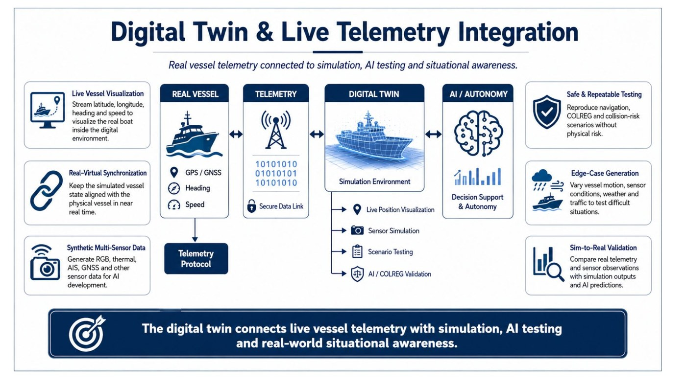

### Multi-view perception: detection & tracking
Perception fuses RGB and thermal cameras, LiDAR, radar, AIS, and GNSS. Multi-view vessel detection and tracking combines real-time detectors (RT-DETR / YOLO) with BoT-SORT tracking, cross-camera association, and AIS-assisted identity to maintain a consistent vessel track across viewpoints — validated in real ports and waterways, including robustness to sensor and modality loss.

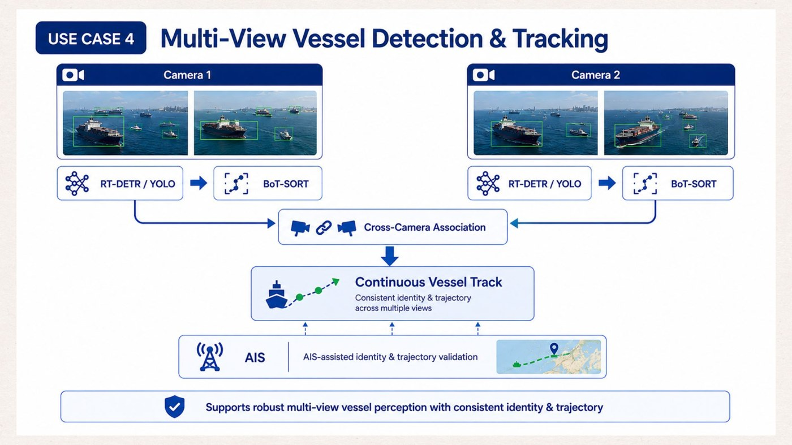

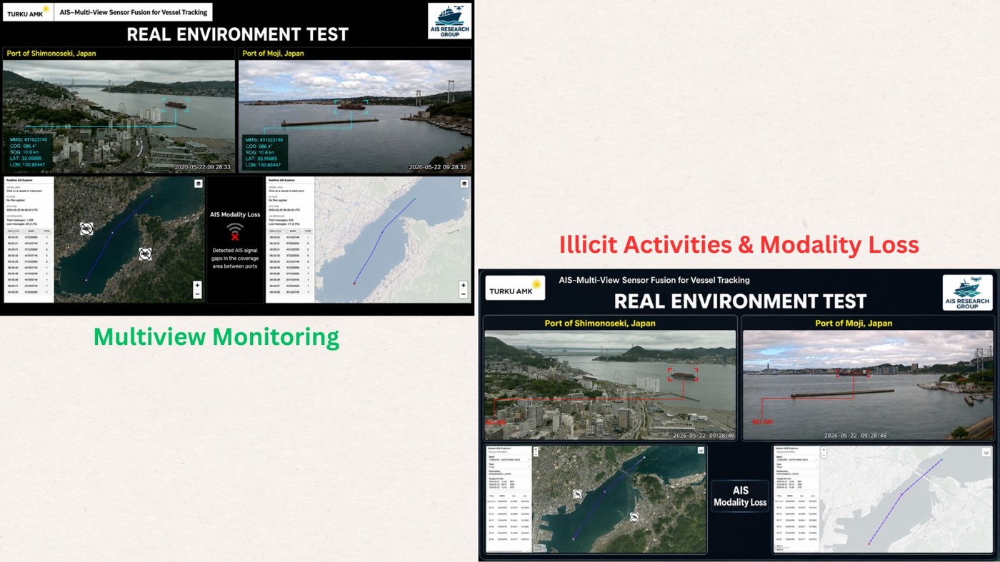

### Critical infrastructure monitoring
Beyond open-water perception, I model critical-infrastructure monitoring scenarios — for example, bridge-mounted camera arrays that watch approaches, exclusion zones, and passing traffic. Overlapping fields of view improve coverage around protected assets and reduce blind spots, supporting detection, tracking, loitering awareness, and incident response.

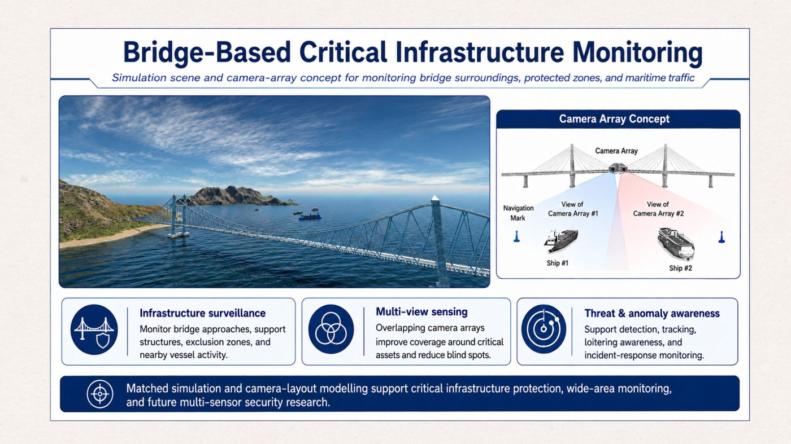

### COLREG-aware collision intelligence
I develop interpretable, geometry- and data-driven collision-risk assessment aligned with COLREG rules — moving from raw object detection to explainable collision understanding that an operator or autonomy stack can trust.

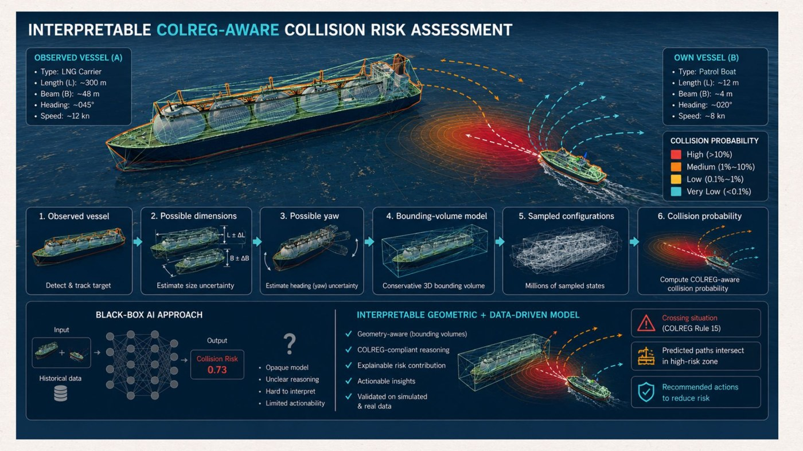

### Sim-to-real validation
A core theme is quantifying and closing the simulation-to-reality gap — pairing real platforms and sensors with their digital-twin and simulated-sensor counterparts, and comparing detection accuracy, sensor characteristics, and model performance across simulated and real domains before field deployment. The programme also includes exploratory research into next-generation AI methods for maritime perception.

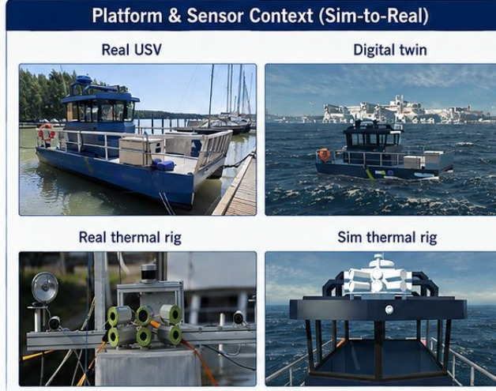

<em>Real platforms and sensors (USV, thermal rig) paired with their digital-twin and simulated-sensor counterparts.</em>

In the media: [Yle](https://yle.fi/a/7-10104914) · [Kauppalehti](https://www.kauppalehti.fi/uutiset/a/2e27af04-232b-4904-b1d2-6ebdb9b342e9) · [Helsingin Sanomat](https://www.hs.fi/suomi/art-2000012256364.html)

## Industrial Robotics & Interpretable AI
*2018 – 2026 · Tampere University · STEM SAS · AISLab*

Across industrial R&D roles I built digital twins and simulation for robotic cells and developed interpretable AI for robot safety. On the simulation side, I implemented path-planning, route-optimization, and 3D geometric collision-detection algorithms (Separating Axis Theorem, Bounding Volume Hierarchies) with kinematic computation and coordinate transformations. On the ML side, I developed learning-based and rule-based interpretable collision-detection methods for industrial robot manipulators, and AI models for quality prediction in metal additive manufacturing.

This work is published across venues including the *Journal of Mechanical Design*, IEEE FUSION, and the RSS and AHFE workshops — see [Publications](/publications/).

## Autonomous Self-Driving Platform (1/10 scale)
A deep-learning self-driving platform (Python, based on DonkeyCar) for fast experimentation with autopilots before committing to a full-size vehicle. It uses a single forward-facing camera and a CNN trained by behavioral cloning (imitation learning): a human drives to collect ~10,000 samples — camera image, throttle, and steering — at 20 Hz, the data is cleaned, and the network learns to map images to control commands in real time.

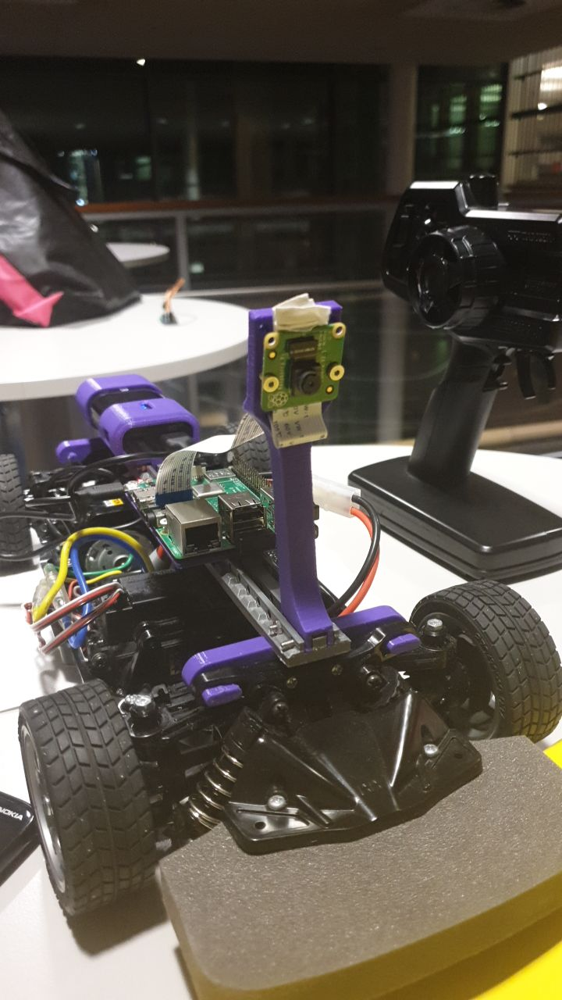

I also built a simulator for synthetic data generation — driving a virtual car with three cameras (left/centre/right) via a PS4 controller — to enlarge and diversify the dataset before real-world training.

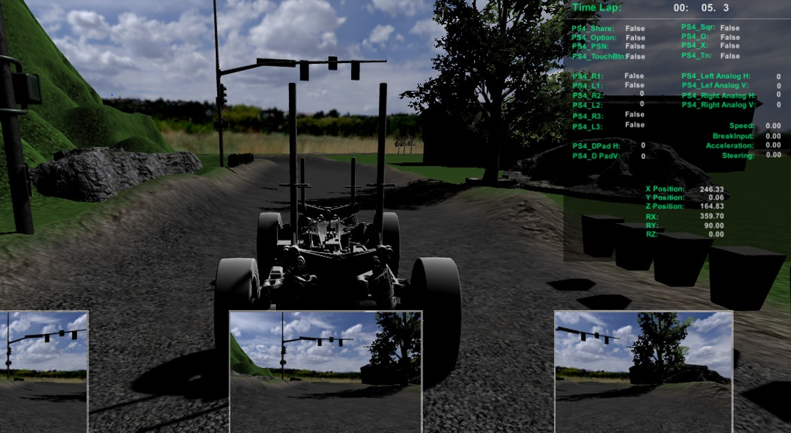

A well-fit network drives smoothly on a controlled indoor track, while an under-fit one fails — underlining how much data quality and lighting consistency matter for vision-only autopilots.

<em>Trained CNN autopilot driving autonomously.</em>

## Earlier Work — RoboCup Small Size League (2009–2011)
As a member of the MRL team, I worked on real-time sensing, motion control, and distributed communication for fully autonomous soccer robots on FPGA/ARM platforms. A central PC processes overhead-camera data, runs the team AI, and commands eight robots by radio ~60 times per second. The robot electronics paired an Altera Cyclone FPGA with an ARM core, offloading parallel motor control and PID computation to the FPGA. MRL placed 1st at the national RoboCup and 3rd at the RoboCup 2010 world championship.

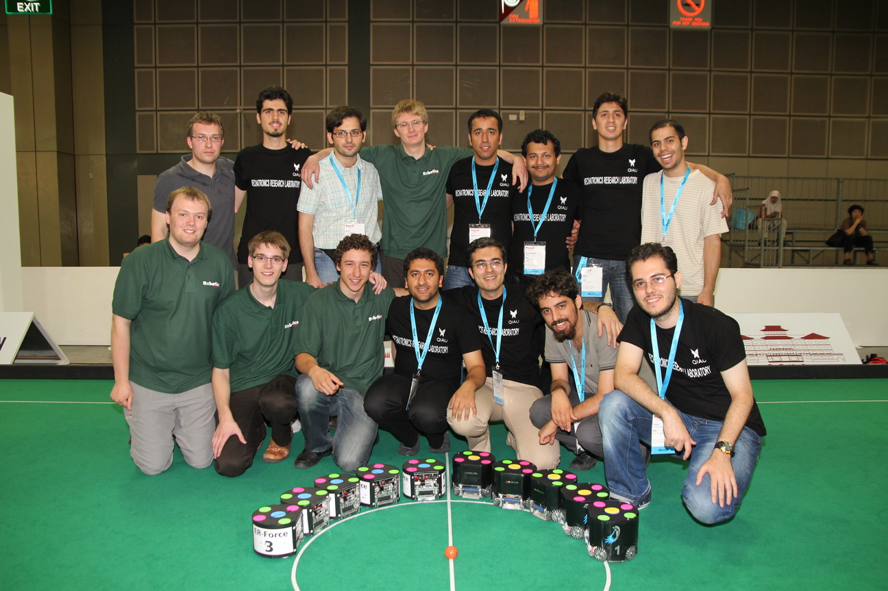

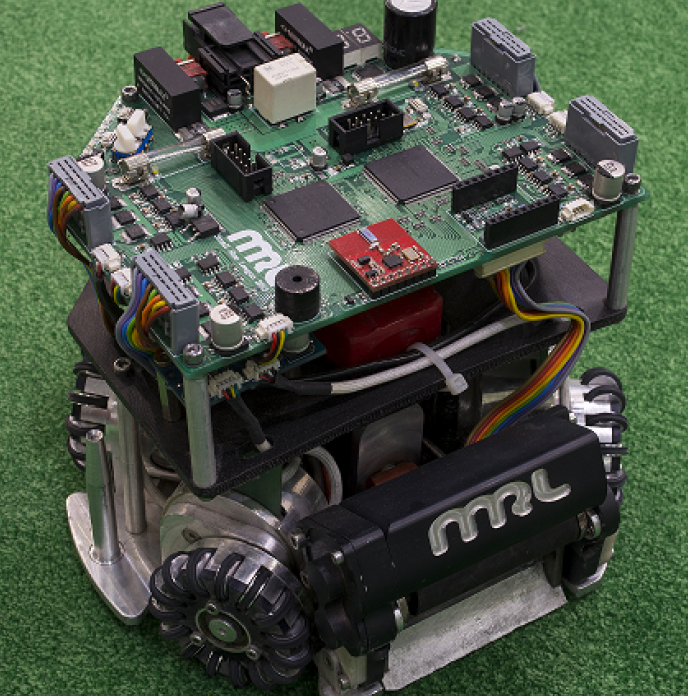

| Place | Team |
|:-----:|------|
| 1 | Skuba |
| 2 | CMDragons |
| 3 | MRL |
| 4 | KIKS |
