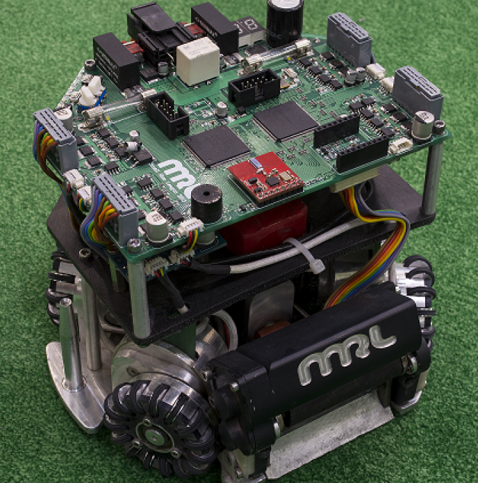

## Autonomous Cars
The autonomous self-driving car was an a design of a platform for remote control cars written in Python based on famous donkeycar. It was further developed to focus on allowing fast experimentation and easy design contributions. It supports autopilots, including neural networks and computer vision systems. The autonomous car which was based on 1/10 of a Formula one racing car offers a rich low scale and real and simulation synthetic data generation so one can experiment with self-driving platform even before you build a robot or real car. 

## Deep learning and Real Data Collection

The deep learning autopilot uses a single forward-facing camera and a convolutional neural network (CNN) to enable autonomous driving through a method called Behavioral Cloning, also known as Imitation Learning. The goal of Behavioral Cloning is to create an autopilot that mirrors human driving actions, making it an intuitive and widely used approach for self-driving systems.

Here’s how the process works for enabling autonomous driving:

**Data Collection:** A human driver operates the car to gather training data. As the car is manually driven around the track, the system records data at 20 samples per second. Each sample includes a camera image, throttle position, and steering angle from that specific moment. Typically, around 10,000 samples are required for effective training.

**Data Cleaning:** To ensure data quality, any instances of poor driving—like veering off track or colliding with obstacles—should be removed from the dataset. Alternatively, such data can be discarded in real-time to avoid collecting errors.

**Model Training:** The cleaned dataset is used to train the CNN, teaching it to link specific images with corresponding throttle and steering commands.

**Autonomous Driving:** Once trained, the CNN can predict throttle and steering values based on real-time images. In autopilot mode, the system captures an image, inputs it into the CNN, receives the predicted throttle and steering commands, and sends these to the vehicle’s hardware—updating 20 times per second for smooth driving.

Since the deep learning autopilot relies heavily on visual input, consistent lighting conditions are important. This approach works well on controlled indoor tracks, where lighting and environmental factors are stable. However, outdoor use can be challenging, as changing lighting and environmental conditions may affect performance.

## Small Size Robots

### Overview
In the Small Size League (SSL), each team constructs autonomous cylindrical robots that play soccer with an orange golf ball. During the match, eight robots from each team work to score goals using swift passing maneuvers and intense dueling strategies. The robot system operates entirely autonomously, meaning no team member is allowed to control the robots directly. Instead, a central PC (typically a simple laptop) receives preprocessed camera data, runs the team's AI, and communicates with the robots via radio.

### The Playing Field
The playing field measures 9m x 12m and is covered with a carpet. All 22 robots are monitored by two USB cameras positioned above the field, connected to a centralized vision computer. 

Each robot's top plate features a standardized pattern known as the “Butterfly Pattern” (made of colored paper), clearly identifying its jersey number and team affiliation. The color in the center indicates team affiliation (blue vs. yellow team), while the butterfly design around it represents the jersey number. Additionally, the front two points are spaced further apart than the back ones, allowing the camera to determine the robot’s orientation.

### The Robots
Robot sizes are limited by rules to a diameter of 18 cm and a height of 15 cm, leading to similar appearances. However, the mechanical and electrical designs can vary significantly. Most systems are built with four omni-wheels and electromagnetic kicker devices for linear and chip kicks.

### Main Board
The robot's electronics featured an Altera Cyclone FPGA connected to an ARM core. A parallel motor controller was implementing within the FPGA to reduce the CPU time required for PID controllers' calculations. 

By shifting the controllers to the FPGA, the ARM processor was able to handle other tasks with fewer interruptions. Additionally, a frequency IR sensor for ball detection was introduced along some modifications of the wireless board. 

### 2010 RoboCup Final
The RoboCup 2010 competitions ended again with Skuba (Thailand) team being able to secure the world championship title with a 6:1 win in the final against CMDragons (USA). In the game for third place, MRL (Iran) beat KIKS (Japan) 4:1.

Place	Team	Land
  - 1- Skuba	(From Thailand)
  - 2- CMDragons	(From USA)
  - 3- MRL	(From Iran)
  - 4- KIKS	(From Japan)

### Referee
Currently, a human main referee is responsible for all decisions, supported by a second assistant referee and a RefBox operator. The RefBox is a dedicated computer used to input all decisions, which are then sent to the teams via network connection. Autonomous referee systems, known as Autorefs, have been developed to automate the game further and will see increased use in the league.

### Competing Teams
Both opposing teams receive information from the RefBox and Vision systems via a local network. From this point, it is the team's responsibility to process the input. Typically, the camera data is further analyzed to detect the geometrical placement of robots and the ball on the field. The team's AI then determines a strategy and sends its current decisions to the robots approximately 60 times per second to ensure smooth movements. During the game, no team member is allowed to touch the computer running the strategy. Changes can only be made during timeouts and halftime. One team member is allowed to communicate with the referee and exchange robots on the field.

